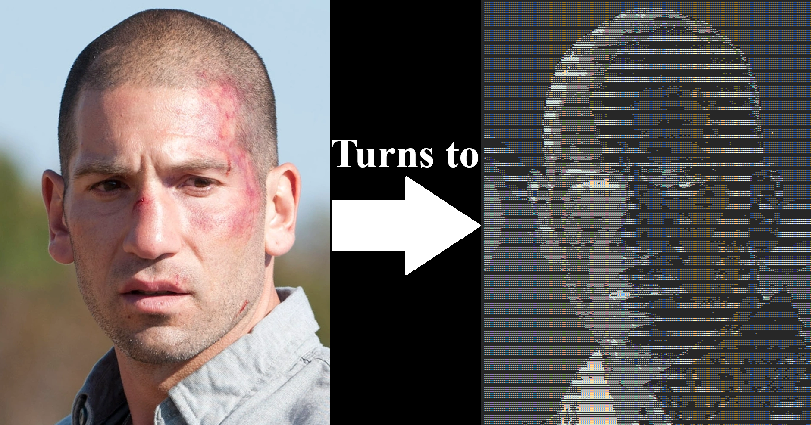

# Image to AsciiArt Converter

This project converts a given image (PNG or JPG) from a URL into ASCII art. Users can specify a scale for the output, with larger numbers producing smaller, more detailed ASCII representations.

## Features

- **Image Conversion**: Converts images to ASCII art by interpreting pixel color data.
- **Customizable Scaling**: Adjust the scale parameter to control the size and detail of the ASCII output (larger number = smaller ASCII art).
- **Supports PNG and JPG Formats**: Works with popular image formats via URLs.

## Example Output

Here is an example of a converted image into ASCII art:

## Credit

This project was inspired by similar image-to-ASCII conversion techniques available online, adapted for Java.
